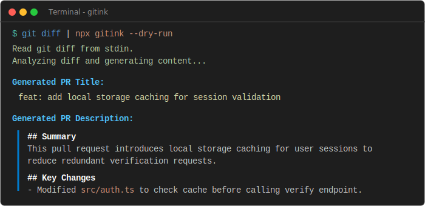

# GitInk

[](https://github.com/Talha12Shiekh/gitink/actions)
[](https://github.com/Talha12Shiekh/gitink)
[](https://www.npmjs.com/package/gitink)
[](https://github.com/Talha12Shiekh/gitink/blob/main/LICENSE)

Automatically generate pull request titles and descriptions using AI.



---

## Table of Contents

- [Features](#features)
- [Getting Started](#getting-started)
- [Usage](#usage)
  - [CLI Mode](#cli-mode)
  - [GitHub Action Mode](#github-action-mode)
- [Configuration](#configuration)
- [Contributing](#contributing)
- [License](#license)

---

## Features

- **Hybrid Workflow**: Use it as a terminal CLI tool during local development or drop it directly into your GitHub Action workflows.
- **Diff Optimization**: Automatically ignores noisy file changes (such as package lockfiles, assets, and compiled directories) to keep analysis clean.
- **Smart Truncation**: Handles large pull requests safely by truncating excessive diff chunks and listing omitted files in the final analysis.
- **Configurable Prompting**: Allows you to customize the AI's generation instructions and output formatting via a simple configuration file.
- **Structured Output**: Enforces valid JSON schema responses from the API to guarantee error-free formatting.

---

## Getting Started

### Prerequisites

- Node.js >= 20.0.0
- An API key for Google Gemini (obtainable from Google AI Studio)

### Installation

You can run GitInk on demand without permanent installation:

```bash
npx gitink --help
```

Alternatively, install it globally on your system:

```bash
npm install -g gitink
```

---

## Usage

### CLI Mode

To test or run GitInk's AI analysis locally, you can execute it in CLI mode using one of the following methods:

#### Method 1: Zero-Setup Quick Run (No installation required)

You can run GitInk instantly on demand without installing it or setting environment variables by passing your credentials directly via the `--key` (`-k`) and `--token` (`-t`) flags.

##### Dry-Run Unstaged Changes
Analyze local file modifications that have not been staged yet:
```bash
git diff | npx gitink --dry-run --key "your_gemini_api_key"
```

##### Dry-Run Staged Changes
Analyze changes that have been added to the staging area with `git add`:
```bash
git diff --staged | npx gitink --dry-run --key "your_gemini_api_key"
```

##### Dry-Run All Uncommitted Changes
Analyze both staged and unstaged local changes:
```bash
git diff HEAD | npx gitink --dry-run --key "your_gemini_api_key"
```

##### Dry-Run Committed Changes
Analyze commits made on your current branch since it split from `main`:
```bash
git diff main...HEAD | npx gitink --dry-run --key "your_gemini_api_key"
```

##### Update Active GitHub Pull Request
Directly submit the generated title and description to an open pull request on GitHub:
```bash
npx gitink --repo "owner/repo" --pr 42 --key "your_gemini_api_key" --token "your_github_personal_access_token"
```

#### Method 2: Session Environment Variables

Alternatively, to avoid typing credentials for every command, set them in your terminal session first.

##### Windows (PowerShell)
```powershell
$env:GEMINI_API_KEY="your_api_key_here"
```

##### macOS / Linux (Bash)
```bash
export GEMINI_API_KEY="your_api_key_here"
```

Once the environment variable is configured, run the matching command for your repository state:

##### Dry-Run Unstaged Changes
```bash
git diff | npx gitink --dry-run
```

##### Dry-Run Staged Changes
```bash
git diff --staged | npx gitink --dry-run
```

##### Dry-Run All Uncommitted Changes
```bash
git diff HEAD | npx gitink --dry-run
```

##### Dry-Run Committed Changes
```bash
git diff main...HEAD | npx gitink --dry-run
```

##### Update Active GitHub Pull Request (Requires GITHUB_TOKEN)

**Windows (PowerShell):**
```powershell
$env:GEMINI_API_KEY="your_api_key_here"
$env:GITHUB_TOKEN="your_github_personal_access_token"

npx gitink --repo "owner/repo" --pr 42
```

**macOS / Linux (Bash):**
```bash
export GEMINI_API_KEY="your_api_key_here"
export GITHUB_TOKEN="your_github_personal_access_token"

npx gitink --repo "owner/repo" --pr 42
```

### CLI Options

You can customize the execution of the CLI using the following options:

```text
Usage: gitink [options]

Auto-generate GitHub PR titles and descriptions using Gemini AI

Options:
  -V, --version        output the version number
  -k, --key <key>      Gemini API Key
  -t, --token <token>  GitHub Token
  -r, --repo <repo>    GitHub Repository (owner/repo)
  -p, --pr <number>    PR Number
  -c, --config <path>  Path to config JSON file
  -d, --dry-run        Generate and print description without updating GitHub
  -m, --model <model>  Gemini model to use (default: gemini-2.5-flash)
  -h, --help           display help for command
```

---

### GitHub Action Mode

To automate PR descriptions on every commit, add this workflow file to your repository at `.github/workflows/gitink.yml`:

```yaml
name: GitInk PR Auto-Describer

on:
  pull_request:
    types: [opened, reopened, synchronize]

jobs:
  describe-pr:
    runs-on: ubuntu-latest
    permissions:
      pull-requests: write

    steps:
      - name: Checkout repository
        uses: actions/checkout@v4

      - name: Run GitInk Generator
        uses: Talha12Shiekh/gitink@main
        with:
          gemini-api-key: ${{ secrets.GEMINI_API_KEY }}
          github-token: ${{ secrets.GITHUB_TOKEN }}
```

### GitHub Environment Setup

To run GitInk in your repository's actions, you need to configure access credentials:

1. **Set up GEMINI_API_KEY**:
   - Go to your repository on GitHub.
   - Navigate to **Settings** -> **Secrets and variables** -> **Actions**.
   - Click on **New repository secret**.
   - Set the name to `GEMINI_API_KEY` and paste your Gemini API key from Google AI Studio as the value.

2. **Set up GITHUB_TOKEN**:
   - The `GITHUB_TOKEN` is a built-in token automatically created by GitHub for every workflow run. You do not need to manually define it in your secrets.
   - Ensure the workflow has the `permissions: pull-requests: write` property configured (this is already included in the YAML template above) to grant the token access to update your pull request.

---

## Configuration

You can customize GitInk's files validation and prompt settings by creating a `.prsmith.json` file in the root of your project:

```json
{
  "exclude": [
    "package-lock.json",
    "yarn.lock",
    "pnpm-lock.yaml",
    "dist/**",
    "*.png",
    "*.jpg"
  ],
  "maxDiffLength": 60000,
  "prompt": "Analyze the changes and write a pull request description in a concise, bulleted format. Keep the tone technical and direct."
}
```

---

## Contributing

We welcome community contributions. To set up the project locally:

1. Clone the repository:
   ```bash
   git clone https://github.com/Talha12Shiekh/gitink.git
   cd gitink
   ```
2. Install development dependencies:
   ```bash
   npm install
   ```
3. Compile TypeScript files:
   ```bash
   npm run build
   ```

For detailed coding standards and pull request workflows, please read our [CONTRIBUTING.md](CONTRIBUTING.md).

---

## License

This project is licensed under the MIT License - see the [LICENSE](LICENSE) file for details.
